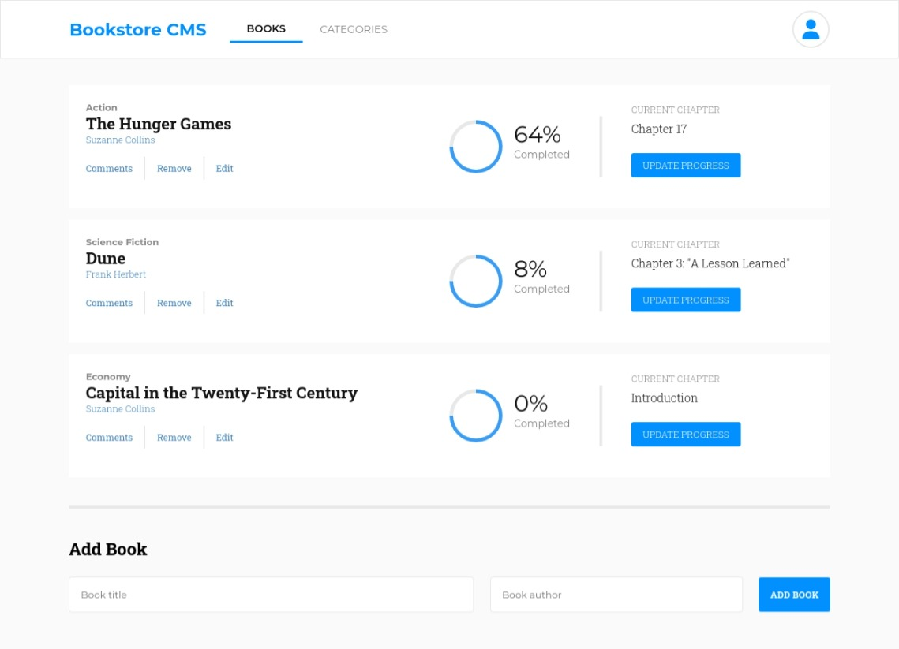

# Bookstore-RX

> The Bookstore is a website similar to "Awesome Books" website. This version simple website that displays a list of books and allows you to:
> - Display a list of books.
> - Add a book.
> - Remove a selected book.
> - Discus about a book by making comments

## Preview

## Built With (Linter)

- ReactJS
- JavaScript (Eslint)
- CSS (Stylelint)

## Prerequisites
The following applications are required to be installed for the project to run!
- Modern browser e.g [Google Chrome](https://www.google.com/chrome/), [Edge](https://www.microsoft.com/en-us/edge?r=1), [Firefox](https://www.mozilla.org/en-US/exp/firefox/new/) etc.
- [Node.js](https://nodejs.org/en/download/) LTS version
- [Git](https://git-scm.com/downloads)

## App Setup
- Clone [this](https://github.com/PraisesPJMT/Bookstore-RX.git) GitHub repository using `git clone git@github.com:PraisesPJMT/Bookstore-RX.git`
- Download all required modules using `npm install` inside the project directory (/Bookstore-RX)
- Launch project on browser using `npm start` inside the project directory (/Bookstore-RX)
    - This should launch the app on the browser
    - If the app is not opened immediately, then open [http://localhost:3000](http://localhost:3000) to view it in your browser.

## App Deployment
App deployment is coming soon...

## Authors

👤 **Praises Tula**

- GitHub: [@praisespjmt](https://github.com/PraisesPJMT)
- Twitter: [@praisespjmt](https://twitter.com/PraisesPJMT)
- LinkedIn: [Praises Musa Tula](https://www.linkedin.com/in/praises-tula-9233aa76)

## 🤝 Contributing

Contributions, [issues](https://github.com/PraisesPJMT/Bookstore-RX/issues), and feature requests are welcome!

## ⭐️ Show your support

Give a ⭐️ if you like this project!

## Acknowledgments

- Hat tip to anyone whose code was used
- Hat tip to you for checking out this amazing project.

## 📝 License

This project is [MIT](./LICENSE) licensed.